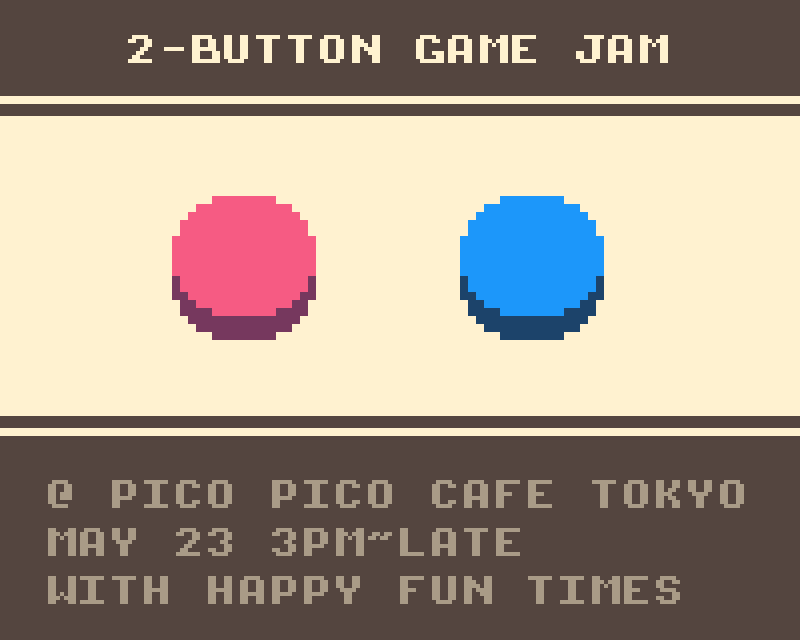

HFT-2-BUTTON-GAMEJAM
====================

This is a template for the [Pico Pico Cafe](http://picopicocafe.com) [HappyFunTimes](http://docs.happyfuntimes.net) 2 button gamejam

This is a sample game for the [HappyFunTimes party games system](http://greggman.github.io/HappyFunTimes).

## Terse Instructions

1.  [Download and install HappyFunTimes](http://superhappyfuntimes.net/install)
2.  clone or download this repo

    to clone

        git clone https://github.com/greggman/hft-2-button-gamejam.git

    [to download click here](https://github.com/greggman/hft-2-button-gamejam/archive/master.zip)

3.  open a terminal / command prompt and type

        cd <path-where-you-cloned-or-unzipped-template>
        hft add

4.  Run HappyFunTimes.

    You should a simple 2 button game. Click it. Open another
    browser window (Ctrl-N or Cmd-N), size it so you can see
    both windows, in the new window go to `http://localhost:18679`.

    You should see 2 button controller appear. You can use the left
    and right keys to press the buttons

    *   Pull out your smartphone
    *   Make sure it's **on the same WiFi as your computer**.
    *   On your phone's browser go to `http://happfuntimes.net`

    The phone should connect

## Short Docs

For the game jam you pretty much just want to edit `scripts/game.js`.
Look inside, it should hopefully be clear how it works.

You'll see a `Player` class. You'll see some code that creates
a new player anytime a player connects and some other code that
deletes a player when they disconnect.

Otherwise this particlar game each player just moves constantly.
The state of each button is in `this.buttonState[0]` and
`this.buttonState[1]`.

There's one example of sending a message to the controller. When
a player starts it picks a random color and sends that color to
the controller. The controller then colorizes itself to match.

Use that as a template if you want to send more messages to the
controller. Or just ask me.

